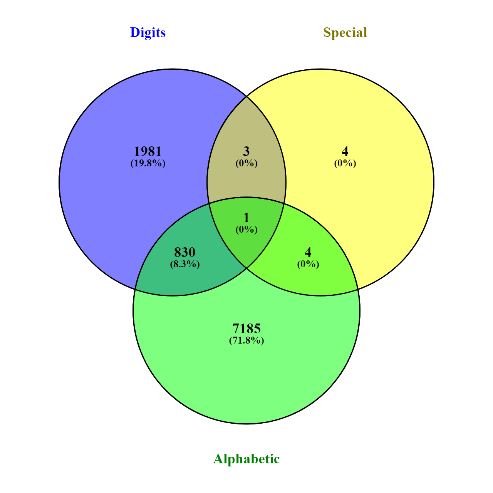

```{r setup, include=FALSE}
knitr::opts_chunk$set(echo = FALSE)

library(tidyverse)
library(ggplot2)
library(cowplot)
library(ggwordcloud)
library(knitr)

pw <- read.csv("common_passwords.csv", header=TRUE)

#remove the two duplicates
pw <- pw[!duplicated(pw),]

# make a new consonants variable
pw$num_consonants <- pw$num_chars - pw$num_vowels
```

# About the Data 

**Data Source:** This set of the 10,000$^1$ most common passwords comes from SecLists and can be found online from a variety of sources. For this project, I downloaded a CSV from [Kaggle](https://www.kaggle.com/shivamb/10000-most-common-passwords). 

**Variables**: password | length | num_chars | num_digits | num_upper | num_lower | num_special | num_vowels | num_syllables

**Variable Description**: Besides the password itself, there are eight other variables describing the length and makeup of the password for each record. Exploratory analysis found that the length of the password is made up of the number of characters (alphabetic, A-Z upper and lowercase), digits (0-9), and special characters (only the following special characters were represented in this data set: $\texttt{* . ? !}$). 

I wasn't able to easily make the Venn diagram to scale to show relative distribution, as we'd prefer based on the principle of expressiveness (using position/location/size to highlight quantity), but I still think this does a good job of highlighting how many of these passwords didn't use a mix of character types as is recommended for strong passwords.

$^1$ _Two of the passwords were duplicated ("abcdef" and "easy"), so I removed the duplicate records (record IDs were 485 and 3508, so this would not affect the top 100 records, but would have affected the top 500), leaving 9998 unique values._

Column
--------------------------------------------------------------------------------

```{r, fig.width=6, fig.height=6, fig.align="center"} 

```

Graphic generated using [Venny](https://bioinfogp.cnb.csic.es/tools/venny/) with numbers generated in ScratchCode.R and translated to a CSV in Excel manually: Oliveros, J.C. (2007-2015) Venny. An interactive tool for comparing lists with Venn's diagrams. https://bioinfogp.cnb.csic.es/tools/venny/index.html

# Variable Distribution

We can see that the most common password lengths are 6, 8, and 7, respectively (one might speculate that this is at least partly due to minimum password length rules, as well as lengths of common words). 

These charts include 0 as a valid count, so passwords with no digits are shown in the digit plot via the far-left bar in the bar chart, and similarly, passwords with no alphabetic characters are represented by the far-left bar in the alphabetic bar chart. 

Column {data-width=375}
--------------------------------------------------------------------------------

```{r}
# length histogram
ggplot(pw, aes(length)) + 
  geom_bar()
```

Column {data-width=375}
--------------------------------------------------------------------------------

```{r}
# look at distribution for alphabet and numeric characters
p_chars <- ggplot(pw, aes(num_chars)) + 
  geom_bar()
p_digits <- ggplot(pw, aes(num_digits)) +
  geom_bar()

plot_grid(p_chars, p_digits, labels = c('Number of (Alphabetic) Chars', 
                                        'Number of Digits'), nrow=2)

```

# Wordcloud

Column {.sidebar}
-----------------------------------------------------------------------
Wordcloud of Top 200 Passwords (in increments of 25)

_(please be patient -- wordcloud takes a little while to load -- and excuse any vulgar slang terms)_

```{r}
numericInput("n_pws", label = "Number of Passwords:", 
             100, min=25, max = 200, step = 25)
```

Column
-----------------------------------------------------------------------

```{r}
renderPlot({
  head(pw, input$n_pws) %>% 
    ggplot(aes(label = password, size = rev(head(as.numeric(rownames(pw)), input$n_pws)),
               color = factor(sample.int(10, input$n_pws, replace = TRUE)))) +
    geom_text_wordcloud(area_corr=TRUE) +
    scale_size_area(max_size = 12)
})
```

# Ideas & Future Plans for Development

I have several ideas to continue to develop this project out further for my own learning and practice. Different companies already have password rules in place that give some of this feedback to people choosing a password, and I could work on my own version.

These ideas include: 

* Using regular expressions to compute the number of occurrences of a character and plot individual character use
* Adding tips for how to make a password more secure, both generically, and given a sample password (e.g. "add another special character to make this password take XYZ amount of time longer to break via brute force means")
* Adding more color and visual information
* Including news tidbits and examples of people who have experienced identity theft due to poor password use
* Adding a pie chart showing average makeup of a typical password of a certain length
* Show common passwords that are contained in other common passwords, and somehow highlight these in the wordcloud or in some other way that shows relative weakness
* Show stacked bar charts showing mean uppercase vs. lowercase alphabetic characters for every given length of password
* Group passwords into types (e.g. celebrity, slang, well-known date, etc.)
* Add flip cards that highlight more information about each variable
